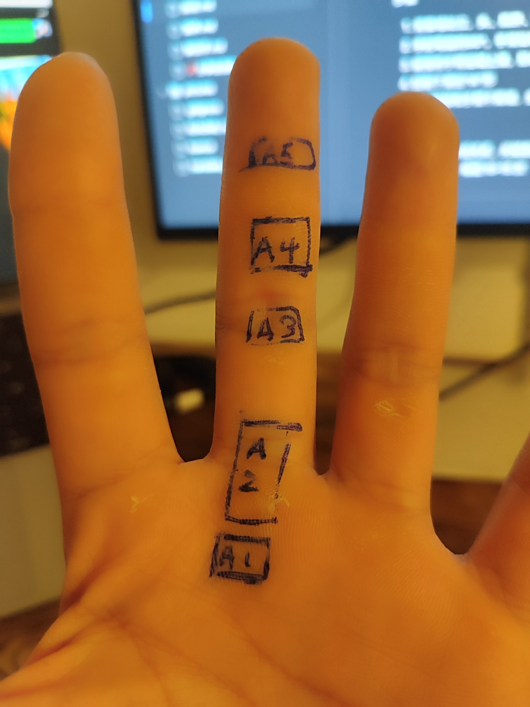

## ⚠️ 手指相关伤病

- 关节软骨、侧副韧带、滑膜结构受伤常见  

---

## 指关节（滑膜关节）

- **关节腔**：富含滑液，减少摩擦  
- **关节软骨**：吸震、抗压，保护骨端  
- **关节囊**：
  - 外层纤维膜：控制活动范围  
  - 内层滑膜：分泌滑液、维持润滑

### 💡 滑膜炎 ≈ 关节炎的一种表现

- 滑液过多 + 回收障碍 → 关节积水
- 常见于关节炎急性发作阶段

---

## ⛓ 滑车损伤（Pulley Injury）

| 滑车       | 位置                     | 功能                                   |
| ---------- | ------------------------ | -------------------------------------- |
| A2         | **近节指骨（靠近掌骨）** | **主要承重、固定肌腱，防止“拉弓效应”** |
| A4         | 中节指骨                 | 也用于稳定肌腱，但负荷略小             |
| A1、A3、A5 | 位于关节附近，作用较次要 |                                        |

### A2 和 A4 滑车

**不附着在关节上 → 缺乏周围骨性保护**

- 像 A1、A3、A5 这样的滑车，正好位于**关节囊与骨突起**附近
   → 有更多组织支撑，受力时结构更稳定
- 而 A2 和 A4 **位于指骨的中段**，没有关节的骨性突起辅助抗张力
   → 当屈肌腱被拉离指骨时，A2/A4 滑车**要独自承受所有牵拉力**

### A2 滑车最容易受伤

杠杆 = 支点 + 施力点 + 阻力点

在手指弯曲抓点时，构成如下：

- **支点**：手指各关节（尤其是指间关节）
- **施力点**：屈指肌腱（flexor tendons）连接肌肉发力处
- **阻力点**：你抓住岩点的位置（远端指节）

杠杆原理应用：

> **力矩 M = 力 F × 力臂 d**

- 在 A2 滑车处，**力臂 d 最长**（指根部距离旋转中心最远）
- 肌腱的牵引力 F 不变时，**力矩 M 最大**
- 为了抵消这个大的力矩，A2 滑车就必须施加**更大的约束力**
   → 因此它承受的“拉离骨头”的力量最大

