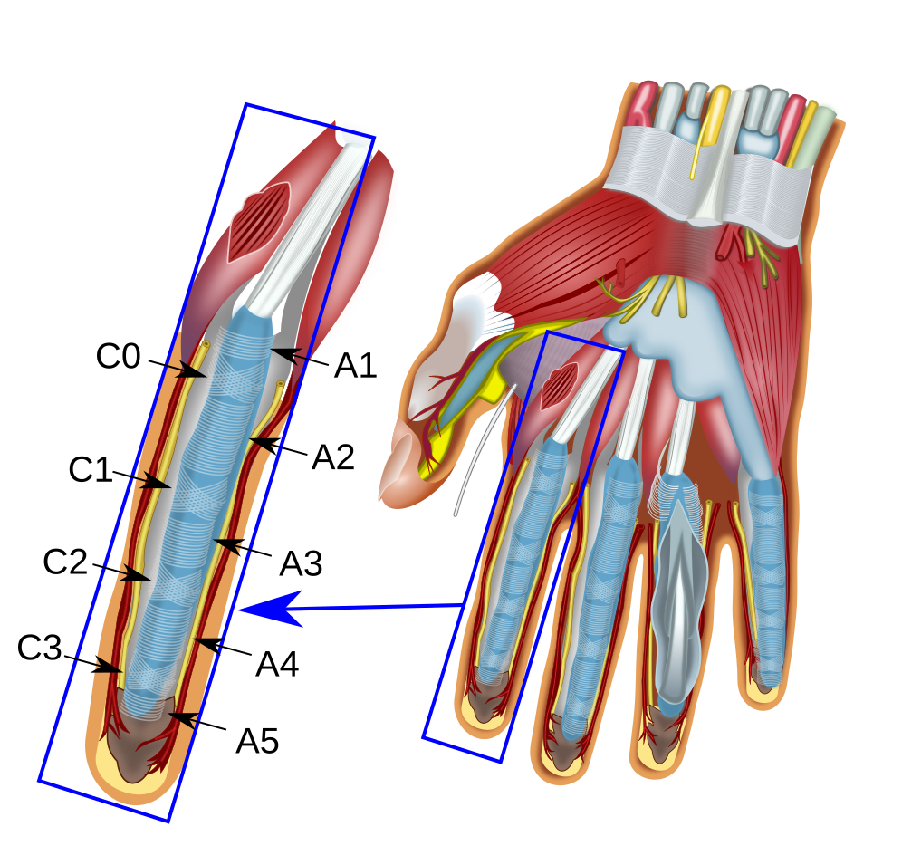

## 手指相关伤病

# 手指解剖结构

## 指屈肌（**Flexor Digitorum**）

每根手指需要两根

| 肌肉    | 全称                                       | 来源     | 控制区域                |
| ------- | ------------------------------------------ | -------- | ----------------------- |
| **FDS** | 浅指屈肌（flexor digitorum superficialis） | 前臂     | **弯曲中节指骨（PIP）** |
| **FDP** | 深指屈肌（flexor digitorum profundus）     | 前臂深层 | **弯曲远节指骨（DIP）** |

## 滑车

| 滑车       | 位置                     | 功能                                   |
| ---------- | ------------------------ | -------------------------------------- |
| A2         | **近节指骨（靠近掌骨）** | **主要承重、固定肌腱，防止“拉弓效应”** |
| A4         | 中节指骨                 | 也用于稳定肌腱，但负荷略小             |
| A1、A3、A5 | 位于关节附近，作用较次要 |                                        |

# 手指扭伤

主要出现在手指 IPP 关节

## 🔍 常见症状

| 症状           | 说明                                     |
| -------------- | ---------------------------------------- |
| 局部肿胀       | IPP 关节肿胀，活动受限                   |
| 按压痛         | 尤其是关节两侧（侧副韧带）或掌侧（掌板） |
| 弯曲或伸直困难 | 可能有卡顿感、疼痛限制活动               |
| 发热、淤血     | 急性期时可能伴随发红或瘀青               |
| 不稳感         | 严重拉伤后感觉关节“松”、“不稳”           |

# 滑车损伤（Pulley Injury）

D.A. Neumann, Kinesiology of the Musculoskeletal System. St. Louis: Mosby, 2002

## A2 和 A4 滑车特征

**不附着在关节上 → 缺乏周围骨性保护**

- 像 A1、A3、A5 这样的滑车，正好位于**关节囊与骨突起**附近
   → 有更多组织支撑，受力时结构更稳定
- 而 A2 和 A4 **位于指骨的中段**，没有关节的骨性突起辅助抗张力
   → 当屈肌腱被拉离指骨时，A2/A4 滑车**要独自承受所有牵拉力**

## A2 滑车最容易受伤

杠杆 = 支点 + 施力点 + 阻力点

在手指弯曲抓点时，构成如下：

- **支点**：手指各关节（尤其是指间关节）
- **施力点**：屈指肌腱（flexor tendons）连接肌肉发力处
- **阻力点**：你抓住岩点的位置（远端指节）

杠杆原理应用：

> **力矩 M = 力 F × 力臂 d**

- 在 A2 滑车处，**力臂 d 最长**（指根部距离旋转中心最远）
- 肌腱的牵引力 F 不变时，**力矩 M 最大**
- 为了抵消这个大的力矩，A2 滑车就必须施加**更大的约束力**
   → 因此它承受的“拉离骨头”的力量最大

# 预防与康复

## 理解不同的手型

- open crimp
- half crimp 
- full crimp （危险，尽量避免）

## 热身专项

## 手指灵活性训练

- 手指灵活性五步法

## 滑车受伤复健

胶原蛋白是**肌腱和韧带的主要组成成分**（主要是I型胶原）。受伤后，身体会尝试合成新的胶原蛋白来**填补和重建受损区域**。适当进行**主动活动（如拉伸、轻度活动）**也有助于胶原蛋白排列得更有序，增强组织质量。食入的胶原蛋白会被分解成小肽和氨基酸，然后在身体中重新合成。其中维生素 C 的合成胶原蛋白的重要因子！多补充维 C

### 低强度康复训练 - 亚强度指力板悬挂 

- 累了就休息，不要勉强
- 康复是为了适应，不要上强度

ChenChen 在荒野文章：https://mp.weixin.qq.com/s/vbSOnX9rHuxm88gnQ_lsyQ

不建议攀岩初期进行高强度指力训练！

- 重塑结缔组织
- 提升自己对手指强度和线路难度的感知

# 药品（仅供参考）

- VoltarenActigo
- 大力手酒

# Reference

Best Rehab Tool for Finger Injuries: Farmer Crimps: https://www.youtube.com/watch?v=IUOm2IHylpA

