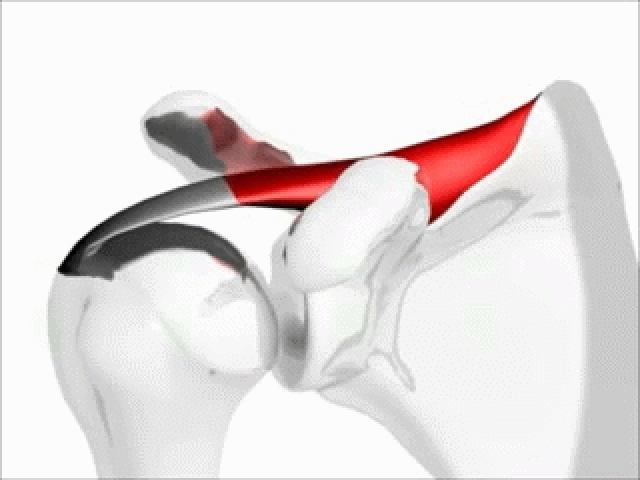
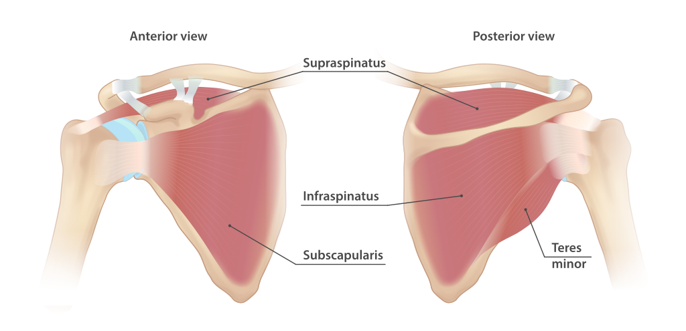

# 肩背篇

# 肩袖肌群稳定性

肩关节（肩胛盂-肱骨头）是人体**活动范围最大、但稳定性最差**的关节。

- 肱骨头像个球
- 肩胛盂像个浅碟



## 什么是肩袖肌群？

| 肌肉（英文）             | 主要作用           |
| ------------------------ | ------------------ |
| 冈上肌 (Supraspinatus)   | 起始抬臂、稳定肱骨 |
| 冈下肌 (Infraspinatus)   | 外旋               |
| 小圆肌 (Teres Minor)     | 外旋               |
| 肩胛下肌 (Subscapularis) | 内旋               |



## 肩袖肌群的作用

1. 稳定肩关节（尤其是悬挂和牵引时）
   在进行悬垂、挂点（dead hangs）、引体或锁定（lock-off）动作时，肩袖肌群帮助稳定肱骨头，使其不脱离肩胛盂。这种“中心化”作用对于防止肩部受伤至关重要。

2. 控制肩部旋转与调整
   在跨越、移动、脚高手低的姿势中，肩关节往往要经历外旋或内旋。肩袖肌群控制这些旋转动作，帮助你精确定位并维持身体平衡。

3. 支撑动态动作和快速转换
   在动态攀爬（如跳跃、爆发力动作）中，肩袖必须迅速协同收缩，以避免肩关节因冲击而受伤。当你跳跃后用手抓住一个新支点时，整个身体重量会通过手臂传导到肩关节。肩袖肌群在这个过程中**快速收缩、拉住肱骨头，稳住它的位置**，防止其不正常移动。

4. 保护肩关节免受慢性损伤
   长期攀岩者常因肩袖肌群力量不均或疲劳导致的肩峰撞击症（impingement）或肩袖撕裂。加强肩袖训练有助于预防这类慢性伤病。

# 常见伤病原因 - 肩袖肌群不稳定

肩袖肌群（冈上肌、冈下肌、小圆肌、肩胛下肌）不是用来产生大力量的，它们最核心的职责是：

> **在手臂移动时，稳定肱骨头在肩胛盂的中央位置**，防止它在各种方向滑动或脱位。

这叫做 **“关节中心化”**（joint centralization）机制。

如果这些肌群**力量薄弱、控制能力差、反应慢**，就会出现以下问题：

## 肩袖撕裂

“**肩袖撕裂**”（英文：**rotator cuff tear**）指的是肩袖肌群中的一块或多块肌肉的**肌腱**部分出现了**部分撕裂**或**完全断裂**的情况。

## 肩峰撞击

“**肩峰撞击**”（英文：**shoulder impingement**）是指肩袖肌腱在肩峰下方受到挤压或摩擦，导致疼痛和活动受限的情况。

```
   肩峰（Acromion）
      ↓↓↓ （狭窄空间）
---------------------------
  肩峰下滑囊 & 冈上肌肌腱
---------------------------
     肱骨头（Humerus head）
```

## 脱臼

**肱骨头完全脱离了肩胛盂**的位置

# 攀岩注意事项

## 1. 避免不自主耸肩

在攀爬过程中，尤其是疲劳或紧张时，很多人会**不自觉地耸肩**（肩胛向上抬），以代偿手臂的力量不足或错误的身体位置。

### ⚠️ 危害：

- 使肩胛失去稳定位置，肩袖肌群必须加倍努力稳定关节
- 增加**肩峰撞击**风险：肱骨头容易撞击肩峰，压迫肩袖肌腱

### ✅ 实践建议：

- 保持肩胛“下沉、内收”的姿态
- 每次挂点时**主动拉低肩胛（scapular depression）**，形成“收紧后背”的感觉
- 攀爬前热身时可做几组**肩胛下拉+肩袖激活训练**

------

## 2. **动态动作中及时下拉肩胛、收紧核心**

当你做**偏动态动作**（如跳跃、单臂移动、跨越）时，在你抓住新点的瞬间，往往会出现身体摇摆或冲击力传导至肩部。

### ⚠️ 危害：

这时如果**肩胛没有下沉**、**核心没收紧**，冲击力会直接作用在肩袖肌腱上，容易造成微损伤甚至撕裂。

### ✅  实践建议：

- 抓住新点后，**立即向下拉肩胛骨**（像是在引体开始发力），同时**核心肌群收紧**，稳定身体，减少横向或扭转摆荡。这相当于**用大肌群（背阔肌、腹肌、臀肌）帮助分担负荷**，减轻肩袖小肌群的压力

- 攀岩前热身可做肩胛下拉

------

## **尽量避免在极限臂展抓点**

当你以接近极限的手臂长度去抓一个点时，肩关节通常处于一个**非常不稳定的位置**（例如手在身体上方且远离躯干）。

### ⚠️ 风险：

- 肩袖无法有效“包住”肱骨头，稳定机制减弱
- 极限臂展还可能拉伸肩袖肌腱，引起慢性损伤或急性撕裂

### ✅ 实践建议：

- 避免“硬拉”远点：尝试换脚、转体、推髋，让身体尽量靠近目标点
- 若不得不抓远点，抓住后立即将肩胛拉下、身体向内靠拢，进入“稳定姿态”
- 提高灵活性和移动效率比一味“够远”更安全、更持久

# 预防和康复手段

## 平衡 ：肩袖肌肉内外旋肌肉

攀岩时常呈躯干收缩、肩膀前倾的姿势，长期会导致内旋肌群（如胸大肌）**缩短僵硬**，限制肩部活动范围，进而拉扯拮抗肌群（外旋肌）。

- 外旋协同肌群：小圆肌与冈下肌、后三角肌共同作用，实现肩关节的外旋动作。它们之间的协同作用确保了肩关节的稳定和灵活性。如果其中一个肌肉功能受损，其他肌肉也可能受到影响
- 内旋拮抗肌群：拮抗肌群主要为胸大肌和肩胛下肌，它们负责肩关节的内旋。肌肉之间的平衡对于维持肩关节的正常功能至关重要。若内旋肌群过于紧绷，会使外旋肌群的压力增大。

**外旋训练（弹力带）**：强化冈下肌、小圆肌


## 拉伸与放松：释放内旋肌群，减少过度张力

由于攀岩动作大量使用内旋肌群（如胸大肌、肩胛下肌、背阔肌），这些肌肉很容易变得紧张缩短，进而限制肩部活动度并拉扯外旋肌。通过**拉伸与筋膜放松**可有效缓解这种不平衡。

**推荐放松与拉伸方法：**

- **胸大肌拉伸（Doorway stretch）**：改善肩部前倾、打开胸部
- **肩胛下肌放松（按摩球贴墙按压腋下前方）**
- **背阔肌拉伸（举臂侧弯式拉伸）**
- **泡沫轴放松肩胛周围区域**：缓解筋膜紧张

## 外旋强化

1. 弹力带固定在侧面
2. 手握带子，**肘部弯曲 90° 并紧贴身体**
3. 控制地将前臂向外旋转
4. 回到起始位，重复

为什么夹毛巾？

- 限制肘部移动，**专注肩关节外旋**
- 防止代偿（躯干旋转或耸肩）
- 增强身体感知反馈（Proprioception）

## 天使抬手

- 激活肩袖肌群（特别是冈上肌、小圆肌）
- 强化肩胛骨的稳定与活动控制

步骤

1. 背靠墙站立，**头、肩胛、臀部贴墙**，脚可略离墙
2. **手肘弯曲约90°，手背贴墙**，成“W”形
3. 缓慢将手臂**沿墙上滑，形成“Y”形**，如“做天使翅膀”般移动
4. 控制下滑回“W”形
5. 保持背部和手臂不离墙，全程慢速、控制进行

Tips:

- 动作范围小没关系，关键是**控制和稳定**
- 做 2–3 组，每组 10–15 次
